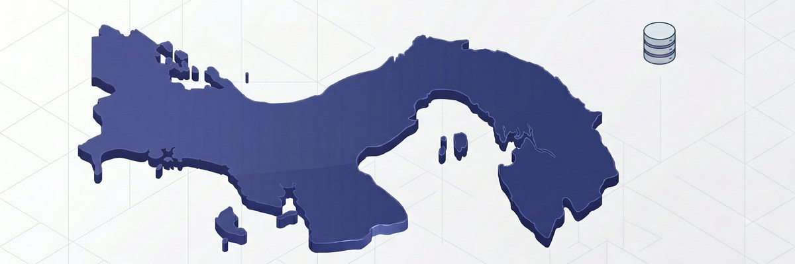

# Panamá - Distritos

[](https://odoo-community.org/page/development-status)
[](http://www.gnu.org/licenses/lgpl-3.0-standalone.html)
[](https://www.odoo.com/documentation/19.0/)
[](https://www.opentech.solutions)
[](https://github.com/opentech-solutions/l10n_pa_provinces)

> ⚠️ Este archivo fue generado con asistencia de herramienta de IA.

Módulo de localización para Panamá que carga los **83 distritos
oficiales** del país como registros del modelo estándar `res.city`
de Odoo, asociándolos a su provincia o comarca correspondiente.

---

## Tabla de contenidos

- [Descripción](#descripción)
- [Funcionalidades](#funcionalidades)
- [Distritos por provincia](#distritos-por-provincia)
- [Instalación](#instalación)
- [Configuración](#configuración)
- [Uso](#uso)
- [Problemas conocidos](#problemas-conocidos)
- [Hoja de ruta](#hoja-de-ruta)
- [Créditos](#créditos)
- [Licencia](#licencia)
- [Referencias](#referencias)

---

## Descripción

La República de Panamá se organiza territorialmente en **10
provincias y 4 comarcas indígenas**, subdivididas a su vez en
**83 distritos**. El distrito es la unidad administrativa
equivalente al municipio en otros países y constituye el segundo
nivel de la jerarquía político-administrativa panameña (después
del país y la provincia/comarca).

Este módulo extiende **`l10n_pa_provinces`** cargando los 83
distritos como registros `res.city` (el modelo estándar de
Odoo para ciudades y unidades administrativas equivalentes), cada
uno vinculado a:

- **País**: Panamá (`base.pa`).
- **Provincia o comarca**: registro correspondiente de
  `l10n_pa_provinces` (PA-1 a PA-10, PA-EM, PA-KY, PA-NB, PA-NT).

### ¿Por qué `res.city` y no un modelo propio?

Odoo provee `res.city` como modelo estándar para representar
ciudades, pueblos y unidades administrativas equivalentes. Panamá
utiliza el término **distrito** en lugar de **ciudad**, pero el
concepto es funcionalmente idéntico. Reutilizar el modelo nativo:

- Garantiza compatibilidad con todos los módulos de Odoo que
  esperan ciudades en direcciones.
- Aprovecha el widget nativo de selección de ciudades con
  autocompletado.
- Permite agrupación, filtrado y reportes geográficos sin código
  personalizado.
- Facilita la integración con mapas y servicios de geocoding.

La etiqueta "Ciudad" del modelo se reemplaza por **"Distrito"**
en español mediante el archivo `i18n/es.po`.

---

## Funcionalidades

- **83 distritos oficiales** cargados vía CSV.
- **Asociación jerárquica**: cada distrito apunta a su
  provincia/comarca padre.
- **Reemplazo de etiqueta**: traduce "Ciudad" → "Distrito" en
  la interfaz española.
- **Vista extendida** en `res.partner`: añade el campo
  `city_id` (distrito) al formulario de dirección cuando el país
  es Panamá.
- **Idempotente**: recargas repetidas no duplican registros.
- **Búsqueda optimizada**: índice por `state_id` y `country_id`
  para autocompletado rápido en formularios.

---

## Distritos por provincia

### Resumen

| Provincia/Comarca | Código ISO | # Distritos |
| ----------------- | ---------- | ----------- |
| Chiriquí          | PA-4       | 14          |
| Veraguas          | PA-9       | 12          |
| Ngäbe-Buglé       | PA-NB      | 9           |
| Los Santos        | PA-7       | 7           |
| Herrera           | PA-6       | 7           |
| Panamá            | PA-8       | 6           |
| Coclé             | PA-2       | 6           |
| Colón             | PA-3       | 5           |
| Panamá Oeste      | PA-10      | 5           |
| Darién            | PA-5       | 4           |
| Bocas del Toro    | PA-1       | 4           |
| Emberá            | PA-EM      | 2           |
| Naso Tjër Di      | PA-NT      | 1           |
| Guna Yala         | PA-KY      | 1           |
| **Total**         |            | **83**      |

### Lista completa

#### Bocas del Toro (PA-1) — 4 distritos

- Bocas del Toro
- Changuinola
- Chiriquí Grande
- Almirante

#### Coclé (PA-2) — 6 distritos

- Penonomé
- Aguadulce
- Antón
- Natá
- La Pintada
- Olá

#### Colón (PA-3) — 5 distritos

- Colón
- Portobelo
- Donoso
- Santa Isabel
- Chagres

#### Chiriquí (PA-4) — 14 distritos

- David
- Boquete
- Bugaba
- Alanje
- Barú
- Boquerón
- Dolega
- Gualaca
- Remedios
- Renacimiento
- San Félix
- San Lorenzo
- Tierras Altas
- Tolé

#### Darién (PA-5) — 4 distritos

- La Palma
- Chepigana
- Pinogana
- Santa Fe

#### Herrera (PA-6) — 7 distritos

- Chitré
- Las Minas
- Los Pozos
- Ocú
- Parita
- Pesé
- Santa María

#### Los Santos (PA-7) — 7 distritos

- Las Tablas
- Guararé
- Los Santos
- Macaracas
- Pedasí
- Pocrí
- Tonosí

#### Panamá (PA-8) — 6 distritos

- Panamá
- San Miguelito
- Arraiján (parte metropolitana)
- Capira
- Chame
- Taboga

#### Veraguas (PA-9) — 12 distritos

- Santiago
- Atalaya
- Calobre
- Cañazas
- La Mesa
- Las Palmas
- Mariato
- Montijo
- Río de Jesús
- San Francisco
- Santa Fe
- Soná

#### Panamá Oeste (PA-10) — 5 distritos

- La Chorrera
- Arraiján
- Capira
- Chame
- San Carlos

#### Emberá (PA-EM) — 2 distritos

- Cémaco
- Sambú

#### Guna Yala (PA-KY) — 1 distrito

- Narganá (cabecera de la comarca)

#### Ngäbe-Buglé (PA-NB) — 9 distritos

- Buabidí
- Mironó
- Nole Duima
- Nurum
- Jirondai
- Santa Catalina
- Kankintú
- Kusapín
- Besiko

#### Naso Tjër Di (PA-NT) — 1 distrito

- Bonyic

> ⚠️ **Nota**: El distrito de **Narganá** se reporta como cabecera
> tradicional de Guna Yala. Algunas fuentes oficiales panameñas
> listan subdivisiones internas adicionales. El módulo carga la
> cabecera principal; las subdivisiones menores pueden agregarse
> manualmente si se requieren.

---

## Instalación

### Requisitos previos

- Odoo 19.0 o superior.
- Módulo **`l10n_pa_provinces`** instalado previamente.
- Módulo `base_address_extended` (incluido en Odoo estándar).

### Pasos

1. Asegúrese de que `l10n_pa_provinces` está instalado:
   > Aplicaciones > buscar "Panamá - Subdivisiones" > Instalar.
2. Copie la carpeta `l10n_pa_districts` a su directorio de
   addons.
3. Actualice la lista de aplicaciones.
4. Busque "Panamá - Distritos" e instale.
5. Verifique que los 83 distritos se hayan cargado:
   > Contactos > Configuración > Ciudades/Distritos.

### Línea de comandos

```bash
docker exec -it <odoo-container> odoo \
  -c /etc/odoo/odoo.conf \
  -d <database> \
  --init=l10n_pa_districts \
  --stop-after-init
```

### Orden de instalación

El módulo declara `depends = ['l10n_pa_provinces']`, por lo que
Odoo instalará automáticamente las provincias si aún no están
presentes.

---

## Configuración

Este módulo **no requiere configuración inicial**. Tras la
instalación:

1. Los 83 distritos aparecen automáticamente en los formularios
   de dirección cuando se selecciona Panamá como país.
2. El campo `city_id` (Distrito) se muestra en la vista extendida
   de `res.partner`.
3. La etiqueta "Ciudad" del selector se reemplaza por "Distrito"
   en español.

### Etiqueta personalizada

Si necesita cambiar la etiqueta visible (por ejemplo, "Corregimiento"
en lugar de "Distrito"), edite el archivo `i18n/es.po` y traduzca
la cadena `model_terms:ir.model.fields,field_description:..city_id`.

---

## Uso

### En formularios de dirección

Al editar un contacto (`res.partner`) o empresa (`res.company`):

1. Seleccione **País** = Panamá.
2. Seleccione **Estado/Provincia** (ej: Chiriquí).
3. Seleccione **Distrito** del menú desplegable filtrado por
   provincia.

El campo Distrito se vuelve obligatorio para Panamá si
`base_address_extended` está configurado en modo estricto.

### En reportes y filtros

Los distritos son filtrables en:

- Reportes de ventas agrupados por geografía.
- Análisis de cartera de clientes por zona.
- Dashboards de cobertura comercial.
- Listas de precios regionales.

### Integración con otros módulos

- **`base_address_extended`**: mejora la jerarquía
  País → Estado → Ciudad.
- **`l10n_pa_extended`**: requiere la estructura geográfica
  completa para sus posiciones fiscales.
- **Módulos de facturación electrónica DGI**: requieren
  códigos geográficos normalizados.

---

## Problemas conocidos

- **Comarcas sin subdivisión política**: Guna Yala (PA-KY) y
  Naso Tjër Di (PA-NT) tienen un solo distrito cargado porque
  administrativamente funcionan como una unidad. Otras comarcas
  como Emberá (PA-EM) tienen 2 distritos. Verifique con su
  receptor si requiere subdivisiones internas adicionales.
- **Distritos nuevos**: la provincia de Panamá Oeste (creada en
  2014) reorganizó distritos previamente bajo Panamá. Algunas
  bases de datos legacy pueden tener asignaciones inconsistentes.
- **Nombres con diéresis y tildes**: `Ngäbe-Buglé`, `Naso Tjër
  Di`, `Kankintú`, etc. requieren PostgreSQL en UTF-8. En bases
  latin1 pueden aparecer caracteres corruptos.
- **Distritos urbanos vs. rurales**: este módulo carga
  cabeceras de distrito, no barrios ni corregimientos (subdivisión
  menor dentro de distritos urbanos).

---

## Hoja de ruta

- [ ] Cargar corregimientos (subdivisión menor urbana) para
      distritos con alta densidad (Panamá, San Miguelito,
      Arraiján).
- [ ] Geometría geográfica (latitud/longitud por cabecera).
- [ ] Soporte multilingüe (nombres en inglés y lenguas
      indígenas: guna, ngäbe, emberá, naso).
- [ ] Actualización automática cuando la DGI publique nuevas
      subdivisiones.
- [ ] Carga de barrios como subregistro de distrito.

---

## Créditos

### Autor

- **OPENTECH SOLUTIONS** — <https://www.opentech.solutions>
- **ROSERO ONE** — Desarrollo principal

### Mantenedor

Este módulo es mantenido por **OPENTECH SOLUTIONS**.

Para reportar problemas, solicitar funcionalidades o contribuir,
visite <https://www.opentech.solutions>.

### Fuentes de datos

- **Instituto Nacional de Estadística y Censo (INEC) de Panamá**
  — División político-administrativa oficial.
- **Ley No. 39 de 1949** — Establece la división en distritos.
- **Decreto Ley No. 1 de 2009** — Crea la provincia de Panamá
  Oeste (reorganiza distritos previos).
- **Leyes especiales** — Creación de comarcas indígenas:
  - Ley No. 16 de 1953 (Guna Yala / San Blas).
  - Ley No. 5 de 1993 (Emberá-Wounaan).
  - Ley No. 10 de 1997 (Ngäbe-Buglé).
  - Ley No. 7 de 2012 (Naso Tjër Di).

---

## Licencia

Este módulo está licenciado bajo **LGPL-3** (GNU Lesser General
Public License v3.0 o posterior).

Puede obtener una copia completa de la licencia en:
<http://www.gnu.org/licenses/lgpl-3.0-standalone.html>

```
Copyright (C) 2026 OPENTECH SOLUTIONS
Todos los derechos reservados.
```

---

## Referencias

- [INEC Panamá — División Político-Administrativa][inec] —
  Fuente oficial de subdivisiones.
- [Constitución Política de la República de Panamá] — Artículos
  5, 6 y 7 (organización territorial).
- [Ley No. 39 de 1949] — Ley de distrito.
- [Odoo Documentation — Address Book][odoo-addr] — Modelo
  `res.city` y jerarquía de direcciones.
- Módulo relacionado: [`l10n_pa_provinces`][l10n_pa_provinces]
  (provincias y comarcas).
- Módulo relacionado: [`l10n_pa_extended`][l10n_pa_extended]
  (localización fiscal extendida).

[inec]: https://www.inec.gob.pa
[Constitución Política de la República de Panamá]: https://www.asamblea.gob.pa
[Ley No. 39 de 1949]: https://www.gacetaoficial.gob.pa
[odoo-addr]: https://www.odoo.com/documentation/19.0/applications/essentials/contacts.html
[l10n_pa_provinces]: https://github.com/opentech-solutions/l10n_pa_provinces
[l10n_pa_extended]: https://github.com/opentech-solutions/l10n_pa_extended

---

<p align="center">
  
</p>